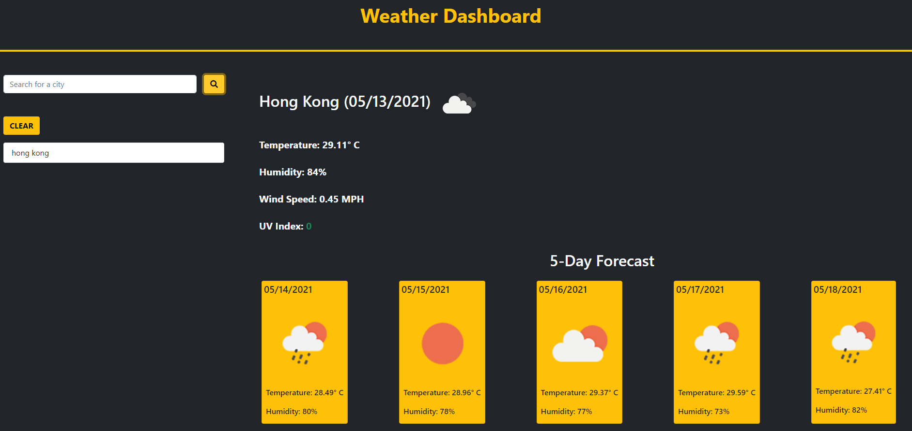
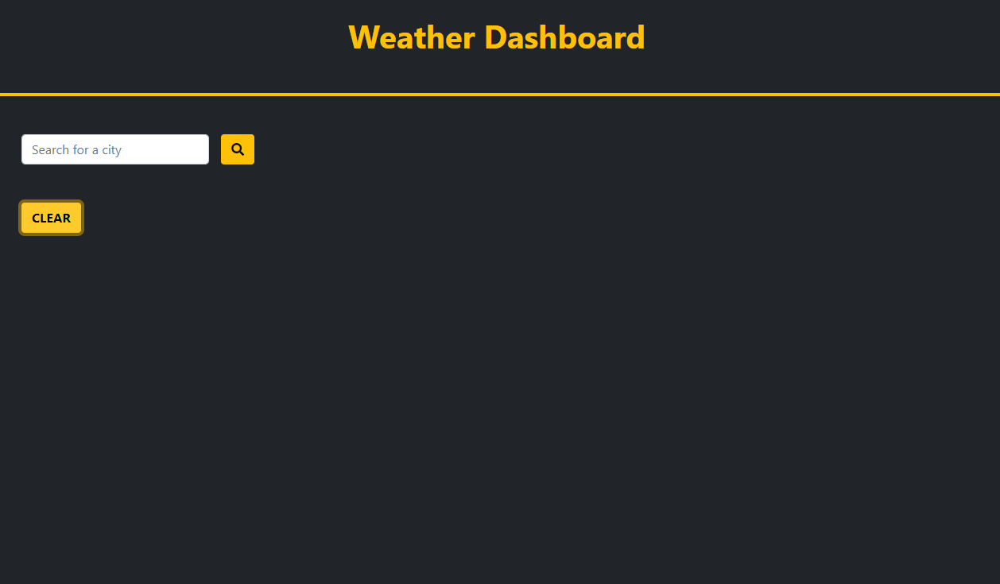

# Server-Side APIs: Weather Dashboard

## Link to deployed URL
[https://marcuslau0903.github.io/week6Server-Side-APIs-Weather-Dashboard/]

## Descriptions: 
A Weather Dashboard using frameworks such as HTML, Bootstrap, powered by Jquery and Javascript. The webpage will retrieve data from third-party weather API [OpenWeather API](https://openweathermap.org/api) by making fetch requests and dynamically render captured data results based on user search input.  In addition, the webpage requires `localStorage` to store any persistent data. 

- [x] WHEN the user searches for a city, the webpage will fetch data from a weather API and return results of current and future weather conditions.
- [x] Searched histories are added to local storage/presented below the search bar, it allows the user to revisit the city by clicking on them.
- [x] Current weather conditions of that city includes the city name, date, an icon representation of weather conditions, the temperature, humidity, wind speed, and the UV index.
- [x] The UV index is presented with a color that indicates whether the conditions are favorable in Green, moderate in Orange, or severe in Red. 
- [x] The future weather conditions for that city is presented with a 5-day forecast that displays date, an icon representation of weather conditions, temperature, and humidity.

## Extra Features:
- [x] Handles repetition, searched cities will only be able to render once.
- [x] Clear button will clear local storage and rendered information on click, presenting a clean page.

## Screen Shots: 

